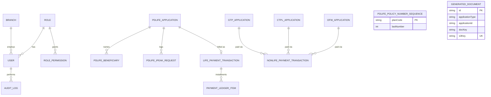

# Paramount Direct 2.0 — Database Schema

Generated from `server/prisma/schema.prisma` — that file is the source of truth; re-generate
this doc if it drifts. A browsable version of this same reference (searchable, live-rendered
diagram) is published at: https://claude.ai/artifact/VcCNqqE1uARECufh4DiPgF

`PK` primary key, `FK` foreign key, `UK` unique constraint.

## Entity relationship diagram

Real Prisma `@relation` foreign keys only — models with fields that reference another model
without an actual DB-level FK (`GeneratedDocument.applicationId`) are called out in their own
section below instead of drawn as a relationship here.

## Users & Roles

### `User`

| Field | Type | Notes |
|---|---|---|
| `id` PK | String (cuid) | |
| `firstName` / `lastName` | String | |
| `email` UK | String | |
| `passwordHash` | String | bcrypt |
| `status` | enum | `Active` \| `Inactive` |
| `assignedProducts` | String[] | e.g. `["PD Life", "OFW"]` — which product tabs this account can open |
| `lastLoginAt` | DateTime? | |
| `roleId` FK | String? | → `Role.id` |
| `branchId` FK | String? | → `Branch.id` |

Relations: belongs to one `Role` (optional), one `Branch` (optional); has many `AuditLog`.

### `Role`

| Field | Type | Notes |
|---|---|---|
| `id` PK | String (cuid) | |
| `name` UK* | String | *unique together with `productScope` |
| `productScope` | String | `"PD Life"` \| `"OFW"` \| `"CTPL"` \| `"GTP"` |
| `isDirectMarketing` | Boolean | newer Direct Marketing role set vs. the legacy PD Life list |

Relations: has many `User`, many `RolePermission`.

### `RolePermission`

| Field | Type | Notes |
|---|---|---|
| `id` PK | String (cuid) | |
| `roleId` FK | String | → `Role.id`, cascade delete |
| `moduleName` | String | unique with `roleId` |
| `canRead` / `canWrite` / `canDelete` | Boolean | |

## Branches

### `Branch`

| Field | Type | Notes |
|---|---|---|
| `id` PK | String (cuid) | |
| `division` | enum | `LIFE` \| `NON_LIFE` |
| `region` / `province` / `city` / `address` / `barangay?` / `zipcode` | String | |
| `mobile` / `telephone` / `fax?` / `email?` / `website` | String | |
| `status` | enum | `Active` \| `Inactive` |

Relations: has many `User`.

## PD Life applications

Category-specific data (medical questions, employment, etc.) lives in `details` as JSON
rather than columns, since it varies by plan category.

### `PdLifeApplication`

| Field | Type | Notes |
|---|---|---|
| `id` PK | String (cuid) | |
| `payor`, `source` | String | |
| `planCategory` | enum | `Health` \| `LifeAccident` \| `Comprehensive` |
| `planCode` / `planDesc` / `premium` | String | |
| `status` | enum | `Received` \| `For_Verification` \| `For_Evaluation` \| `Paid` \| `Issued` |
| `details` | Json | category-specific applicant/medical/beneficiary data |
| `policyNumber` UK | String? | assigned by iPeak/LEAP on transmit; format `PLANCODE-NNNNNN-D` |
| `firstName` … `email` (18 cols) | mostly String? | insured's personal/employment details — insured is always their own policy owner in this product line |

Relations: has many `PdLifeBeneficiary`, many `PdLifeIpeakRequest`; has one optional
`LifePaymentTransaction` (joined by `policyNumber` ↔ `policyNo`, not an id FK).

### `PdLifeBeneficiary`

| Field | Type | Notes |
|---|---|---|
| `id` PK | String (cuid) | |
| `applicationId` FK | String | → `PdLifeApplication.id`, cascade delete |
| `fullName` / `birthdate` / `relationship` | String / DateTime | |
| `sharePercent?` / `designation?` / `trusteeName?` | Float? / String? | |

### `PdLifeIpeakRequest`

Audit/retry trail for every call made to iPeak (LEAP Services).

| Field | Type | Notes |
|---|---|---|
| `id` PK | String (cuid) | |
| `applicationId` FK | String | → `PdLifeApplication.id` |
| `policyNumber` | String | |
| `method` | enum | `NewBusiness` \| `UpdateStatus` |
| `requestPayload` / `responseBody?` | Json | |
| `statusCode?` / `success` / `errorMessage?` / `retryCount` | Int? / Boolean / String? / Int | |

### `PdLifePolicyNumberSequence`

No relations — a sequence counter table.

| Field | Type | Notes |
|---|---|---|
| `planCode` PK | String | |
| `lastNumber` | Int | last sequential number issued for that plan code — incremented atomically so concurrent submissions never collide |

## OFW applications

### `OfwApplication`

| Field | Type | Notes |
|---|---|---|
| `id` PK | String (cuid) | |
| `lastName` … `referralSource` (12 cols) | String / enum | applicant identity/contact; `gender`, `civilStatus` enums |
| `natureOfEmployment` | enum | `Direct_hired` \| `Balik_Manggagawa` |
| `coverageType` | enum | `Land_based` \| `Sea_based` |
| `salaryAmount` / `salaryCurrency` | Float / enum | `PHP` \| `USD` \| `HKD` \| `Others` |
| `employerName` / `employerCountry` / `contractStart` / `contractEnd` / `insuranceStart` / `isConflictZone` | mixed | |
| `passportDoc` / `visaDoc` / `employmentContractDoc` / `medicalCertificateDoc` | enum | `Uploaded` \| `Missing` — per-document checklist status, not file storage |
| `status` | enum | `Received` \| `Cancelled` \| `Duplicate` \| `Reversed` |
| `policyNumber` UK / `referenceNo` UK | String? | assigned once paid/issued |

Relations: has many `NonLifePaymentTransaction` (`product = OFW`).

## CTPL applications

### `CtplApplication`

| Field | Type | Notes |
|---|---|---|
| `id` PK | String (cuid) | |
| `policyType` | enum | `Private_Car` \| `Commercial_Vehicle` \| `Motorcycle` |
| `mvType` | String | |
| `renewalType` | enum | `New_1_Year` \| `Renewal` |
| `clientType` | enum | `Individual` \| `Corporate_without_assignee` \| `Corporate_with_assignee` |
| `ownerFirstName` … `mobileNumber` (8 cols) | String / Boolean | owner vs. applicant identity; `sameAsOwner` toggle |
| `plateNumber` / `mvFileNumber` / `chassisNumber` | String | |
| `requiresCOV` | Boolean | |
| `status` | enum | `Completed` \| `Spoiled` \| `Duplicate` \| `Reversed` \| `Cancelled` |
| `policyNumber` UK / `referenceNo` UK | String? | assigned once paid/issued |

Relations: has many `NonLifePaymentTransaction` (`product = CTPL`).

## GTP applications

### `GtpApplication`

| Field | Type | Notes |
|---|---|---|
| `id` PK | String (cuid) | |
| `travelType` | enum | `International` \| `Domestic` |
| `destinations` | String[] | |
| `departureDate` / `returnDate` / `daysOfTravel` | DateTime / Int | |
| `applicationType` | enum | `Individual` \| `Family` |
| `travelerFirstName` … `mobileNumber` | String / DateTime | |
| `planVariant` | enum | `Single_Trip` \| `Multi_Trip_90` \| `Multi_Trip_180` |
| `cruiseCoverage` / `hazardousSportsCoverage` / `isSchengenDestination` | Boolean | |
| `status` | enum | `Received` \| `Cancelled` \| `Duplicate` |
| `policyNumber` UK / `referenceNo` UK | String? | assigned once paid/issued |

Relations: has many `NonLifePaymentTransaction` (`product = GTP`).

## Payments & Ledgers

PD Life bills on an installment ledger; CTPL/OFW/GTP are straight-through one-time payments.

### `LifePaymentTransaction`

| Field | Type | Notes |
|---|---|---|
| `id` PK | String (cuid) | |
| `policyNo` UK, FK | String | → `PdLifeApplication.policyNumber` |
| `title` … `emailAddress` (12 cols) | String / DateTime / Int | insured identity snapshot at billing time |
| `policyStatus` | enum | `Inforced` \| `Lapsed` \| `Terminated` \| `Matured` \| `Involuntary` \| `Voluntary` \| `Surrender` |
| `premium`, `hcrPremium`, `deposit`, `underpay`, `cashValue`, `lifeBenefits`, `accidentalBenefits` | Float | |
| `dueDate`, `issueDate`, `effectivityDate`, `policyDate`, `expiryDate` | DateTime | |
| `planCode` / `planDesc` / `orDate?` / `orNumber?` | String | |

Relations: belongs to one `PdLifeApplication` (via `policyNo`); has many `PaymentLedgerItem`.

### `PaymentLedgerItem`

| Field | Type | Notes |
|---|---|---|
| `id` PK | String (cuid) | |
| `paymentId` FK | String | → `LifePaymentTransaction.id`, cascade delete |
| `yrInstal` / `dueDate` / `status` | String / DateTime / String | |
| `uploaded` / `amountPaid` / `underpay` | Float | |
| `orNumber` / `orDate?` | String / DateTime? | |

### `NonLifePaymentTransaction` (CTPL / OFW / GTP)

| Field | Type | Notes |
|---|---|---|
| `id` PK | String (cuid) | |
| `product` | enum | `CTPL` \| `OFW` \| `GTP` — says which FK below is populated |
| `policyNumber` / `referenceNo` / `payorName` / `planLabel` / `premium` / `dateReceived` | String / DateTime | |
| `ctplApplicationId` FK | String? | → `CtplApplication.id` |
| `ofwApplicationId` FK | String? | → `OfwApplication.id` |
| `gtpApplicationId` FK | String? | → `GtpApplication.id` |

Prisma has no polymorphic relation, so each possible parent gets its own nullable FK; exactly
one of the three should be set per row (enforced in the API layer with zod, not the DB) — a
row can also have none set, for a payment logged manually with no matching application on file.

## Generated Documents

Backs the Policy Schedule / COC / OR / Service Invoice download-and-store flow — see Change
Log (20) in `DEVELOPER_HANDOVER.md`.

### `GeneratedDocument`

One immutable row per generated file.

| Field | Type | Notes |
|---|---|---|
| `id` PK | String (cuid) | |
| `applicationType` | enum | `PdLife` \| `OFW` \| `CTPL` \| `GTP` |
| `applicationId` | String | **not a DB-level FK** — polymorphic like `NonLifePaymentTransaction`, but resolved against whichever table `applicationType` names, in application code only |
| `docKey` | String | matches the frontend's `PolicyDocumentSpec.key`, e.g. `"policy-schedule"`, `"or"` |
| `s3Key` UK | String | `documents/{applicationType}/{applicationId}/{docKey}-{timestamp}.pdf` |
| `contentType` | String | default `application/pdf` |
| `generatedAt` / `generatedBy?` | DateTime / String? | |

## Audit Logs

### `AuditLog`

| Field | Type | Notes |
|---|---|---|
| `id` PK | String (cuid) | |
| `timestamp` | DateTime | |
| `userId` FK | String? | → `User.id` |
| `userLabel` | String | denormalized display name, kept even if the user is later deleted |
| `role` / `action` / `module` / `details` / `ipAddress` | String | |
